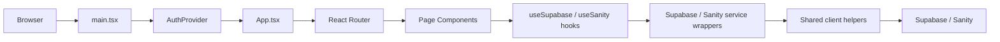

# JavaScript Overview

## Purpose
This document describes the JavaScript-side architecture of the dashboard project after its hybrid upgrade.

## Architecture Note
Important: this project now has two JavaScript runtimes.

- Primary runtime: static HTML pages enhanced by targeted page scripts.
- Secondary runtime: a typed React + Vite SPA accessible through `spa.html`.

## Project Structure
- `package.json`
- `vite.config.js`
- `tsconfig.json`
- `spa.html`
- `src/`
- `App.jsx`
- `main.jsx`
- `App.tsx`
- `main.tsx`
- `index.ts`
- `index.css`
- `components/`
- `contexts/`
- `pages/`
- `hooks/`
- `lib/`
- `services/`
- `types/`
- `data/`

## JavaScript Architecture

### Primary Runtime
Entry path:
`products.html` / `orders.html` / `discounts.html` -> `src/page-scripts/*.js`

Purpose:
Enhance existing admin HTML with live Supabase and Sanity data.

Behavior:
- Finds static DOM mount points
- Fetches data through `src/services/*.js`
- Hydrates existing HTML blocks and tables
- Adds realtime subscriptions where relevant

### Secondary Runtime
Entry path:
`spa.html` -> `src/main.tsx` -> `src/App.tsx`

Purpose:
Provide a structured React Router application with typed hooks and context.

Behavior:
- Boots React in `BrowserRouter`
- Wraps the app in `AuthProvider`
- Reads from shared Supabase and Sanity services
- Renders typed pages and reusable components

## Layered Architecture
- `main.tsx` bootstraps React, `BrowserRouter`, and `AuthProvider`
- `App.tsx` declares the route tree
- `pages/` define route-level UI
- `hooks/` expose business logic and data fetching
- `services/` wrap the existing runtime service layer
- `lib/` exposes config, clients, logger, and utility helpers
- `components/` and `components/ui/` render reusable interface blocks

## Routing Structure
Routes defined in `src/App.tsx`:
- `/`
- `/product-listing`
- `/product-detail`
- `/product-detail/:slug`
- `/cart`
- `/checkout`
- `/checkout-not-logged-in`
- `/review-and-pay`
- `/order-confirmation`
- `/order-checkup`
- `/login`
- `/create-account`
- `/forgot-password`
- `/personal-info`
- `/my-orders`
- `/order-details`
- `/addresses`

## Data Flow

## Behavior Verification
- `src/main.jsx` and `src/App.jsx` still exist for the original React runtime.
- `src/main.tsx` and `src/App.tsx` now provide a second SPA runtime.
- `src/contexts/AuthContext.tsx` exposes auth state through `useAuth()`.
- `src/hooks/useSupabase.ts` and `src/hooks/useSanity.ts` provide typed data hooks.
- `src/lib/supabase.ts` and `src/lib/sanity.ts` expose shared clients for the SPA layer.
- `src/services/admin-service.js`, `src/services/auth-service.js`, and `src/services/sanity-service.js` remain the shared live-data foundation.

## Notes
- The HTML-driven runtime remains the production-facing admin enhancement layer.
- The SPA runtime is scaffolded and ready for deeper feature migration.
- Both runtimes share the same Sanity and Supabase integrations.
