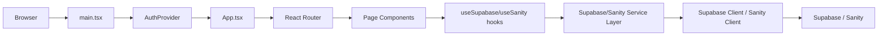

# JavaScript Overview

## Purpose
This file documents the JavaScript-side architecture of the `ecommercev2-storefront` project. It describes the React + Vite application, the component and page structure, routing, and the way client-side JavaScript orchestrates app behavior.

## Architecture Note
⚠️ **Important**: This storefront has a hybrid architecture with two entry points. See `Project Overview.md` for details on the HTML-driven runtime vs TypeScript SPA implementation.

## Project Structure (JavaScript-focused)

Root structure:

- `package.json`
- `vite.config.ts`
- `tsconfig.json`
- `src/`
  - `App.tsx`
  - `main.tsx`
  - `index.ts`
  - `index.css`
  - `components/`
    - `Navbar.tsx`
    - `Footer.tsx`
    - `Sidebar.tsx`
    - `AuthExample.tsx`
    - `IntegrationExample.tsx`
    - `ui/` (UI primitives and shared UI components)
  - `contexts/`
    - `AuthContext.tsx`
  - `pages/`
    - `HomePage.tsx`
    - `ProductListingPage.tsx`
    - `ProductDetailPage.tsx`
    - `CartPage.tsx`
    - `CheckoutPage.tsx`
    - `CheckoutNotLoggedInPage.tsx`
    - `ReviewAndPayPage.tsx`
    - `OrderConfirmationPage.tsx`
    - `OrderCheckupPage.tsx`
    - `LoginPage.tsx`
    - `CreateAccountPage.tsx`
    - `ForgotPasswordPage.tsx`
    - `PersonalInfoPage.tsx`
    - `MyOrdersPage.tsx`
    - `OrderDetailsPage.tsx`
    - `AddressesPage.tsx`
  - `hooks/`
    - `useSupabase.ts`
    - `useSanity.ts`
    - `index.ts`
  - `lib/`
    - `supabase.ts`
    - `sanity.ts`
    - `config.ts`
    - `logger.ts`
    - `utils.ts`
  - `services/`
    - `supabase-service.ts`
    - `sanity-service.ts`
    - `supabase/` (client helpers, auth providers)
    - `initialized-services.ts`
  - `types/`
    - `index.ts`
  - `data/` and `data/fallback/`

## JavaScript Architecture

This project has a **hybrid architecture** with two JavaScript runtimes:

### Primary Runtime (HTML-Driven)
- **Entry**: `index.html` → `src/main.jsx` → `src/App.jsx`
- **Purpose**: Live storefront that enhances static HTML pages
- **Behavior**: Fetches HTML from `public/pages/`, injects into React root, loads vendor scripts

### Secondary Runtime (TypeScript SPA)
- **Entry**: `src/main.tsx` → `src/App.tsx`  
- **Purpose**: Modern React Router application with typed components
- **Behavior**: Full SPA with `BrowserRouter`, reusable components, and hooks

### Layered Architecture (TypeScript SPA)
The TypeScript SPA is layered as:

1. `main.tsx` bootstraps React and wraps the app with `AuthProvider` and `BrowserRouter`.
2. `App.tsx` declares the client-side route tree using React Router.
3. Pages render from `src/pages/` and consume hooks or context.
4. Hooks in `src/hooks/` expose business logic and data state.
5. Services in `src/services/` talk to Supabase or Sanity through clients in `src/lib/`.
6. UI components in `src/components/` and `src/components/ui/` render the visual interface.

## Routing Structure

Routes defined in `src/App.tsx`:

- `/` → `HomePage`
- `/product-listing` → `ProductListingPage`
- `/product-detail` → `ProductDetailPage`
- `/product-detail/:slug` → `ProductDetailPage`
- `/cart` → `CartPage`
- `/empty-cart` → `EmptyCartPage`
- `/checkout` → `CheckoutPage`
- `/checkout-not-logged-in` → `CheckoutNotLoggedInPage`
- `/review-and-pay` → `ReviewAndPayPage`
- `/order-confirmation` → `OrderConfirmationPage`
- `/order-checkup` → `OrderCheckupPage`
- `/login` → `LoginPage`
- `/create-account` → `CreateAccountPage`
- `/forgot-password` → `ForgotPasswordPage`
- `/personal-info` → `PersonalInfoPage`
- `/my-orders` → `MyOrdersPage`
- `/order-details` → `OrderDetailsPage`
- `/addresses` → `AddressesPage`

## JavaScript Data Flow

Graphically, the data-flow mapping is:

### Behavior of the JavaScript layer

- `main.tsx` starts the app inside `BrowserRouter` and `AuthProvider`.
- `AuthContext.tsx` exposes authentication state through `useAuth()`.
- `useSupabase.ts` handles current user loading, auth state subscriptions, sign-in, sign-up, sign-out, profile fetching, orders, and cart.
- `useSanity.ts` handles Sanity product/category/page queries, search, and category filtering.
- `App.tsx` renders shared layout components (`Navbar`, `Footer`) and page routes.
- Pages are responsible for connecting route parameters to hooks and rendering UI from data.

## JavaScript Behavior Verification

Verified behavior from source:

- `useSupabaseAuth` initializes auth state and subscribes to Supabase auth changes.
- `useSanityProducts`, `useSanityProductBySlug`, and `useSanityCategories` load CMS content as soon as pages mount.
- `src/lib/supabase.ts` reads env variables and creates a Supabase client with persisted sessions and token refresh.
- `src/lib/sanity.ts` creates a Sanity client with CDN configuration and tokenized access.

## Project Relationships

- Pages such as `LoginPage`, `CreateAccountPage`, and `ForgotPasswordPage` depend on the Supabase auth hook.
- Product-related pages such as `ProductListingPage` and `ProductDetailPage` depend on Sanity data hooks.
- Shared UI components consume context state (for example `Navbar.tsx` reads `user` from `useAuth()` to render logged-in UI).
- The app mixes static JSON content from `src/data/` with dynamic content from Supabase/Sanity.

## Notes

- This is a **hybrid client-side application** with both HTML-driven and React SPA implementations.
- The **primary runtime** uses static HTML pages enhanced by React (entry: `main.jsx`).
- The **secondary runtime** is a full React SPA with routing (entry: `main.tsx`).
- Integration routes are handled in `App.tsx` using React Router (for the SPA path).
- The JavaScript layer orchestrates connections between route-driven views and Supabase/Sanity services.
- Both runtimes share the same Supabase and Sanity integrations but have different entry points.