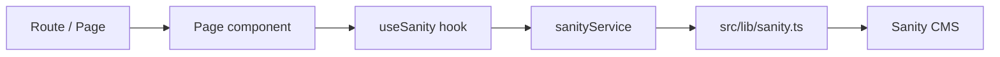
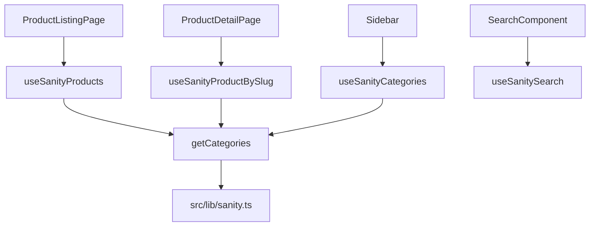

# Sanity Overview

## Purpose
This file explains how Sanity CMS is used in the storefront. Sanity powers product catalog content, categories, page content, and search data.

## Integration Context
Sanity provides content management for the storefront only. The admin dashboard does not currently integrate with Sanity - it focuses on Supabase data for orders, customers, and analytics.

## Key Sanity Files

- `src/lib/sanity.ts`
  - Initializes the Sanity client using environment variables: `NEXT_PUBLIC_SANITY_PROJECT_ID`, `NEXT_PUBLIC_SANITY_DATASET`, `NEXT_PUBLIC_SANITY_API_VERSION`, `SANITY_API_TOKEN`, and `NEXT_PUBLIC_SANITY_USE_CDN`.
  - Exposes `sanityClient`, `sanityTokenizedClient`, and helper functions.

- `src/services/sanity-service.ts`
  - Encapsulates Sanity queries for products, categories, pages, search, and real-time listeners.
  - Returns typed data for product lists, category lists, and content pages.

- `src/hooks/useSanity.ts`
  - Provides hooks for loading products, product details by slug, categories, search results, and category-filtered product lists.

## Sanity Architecture Diagram

## Sanity Data Model and Behavior

Sanity is used for:
- Product content: product title, slug, description, price, images, SKU, stock, categories.
- Category content: category title, slug, description, image.
- Page content and search queries.

The service layer uses GROQ-like queries to fetch content from Sanity.

## Route / View Relationships

### Product catalog and detail

- `/product-listing` → `ProductListingPage.tsx`
  - Uses `useSanityProducts()`.

- `/product-detail` and `/product-detail/:slug` → `ProductDetailPage.tsx`
  - Uses `useSanityProductBySlug(slug)`.

### Category and search

- `useSanityCategories()` provides category metadata used by listing and navigation components.
- `useSanitySearch(searchTerm)` is used for live search filtering within a component or page.
- `useSanityProductsByCategory(categorySlug)` supports category-specific listing if category-based filters are enabled.

### CMS page content

- `sanityService.getPageBySlug(slug)` exists to load generic CMS pages if the app expands to dynamic page routing.

## Data Flow Mapping

## Verified Sanity Behavior

- `sanityService.getProducts(limit, offset)` fetches product documents sorted by creation date.
- `sanityService.getProductBySlug(slug)` resolves product detail by the current slug field.
- `sanityService.search(searchTerm)` executes search across `product` and `category` types.
- `sanityService.getProductsByCategory(categorySlug, limit, offset)` provides paginated category product results.
- Category listing is loaded once and can be used by multiple page views.

## Environment and Deployment Notes

Sanity requires:
- `NEXT_PUBLIC_SANITY_PROJECT_ID`
- `NEXT_PUBLIC_SANITY_DATASET`
- `NEXT_PUBLIC_SANITY_API_VERSION`
- `SANITY_API_TOKEN` for authorized requests
- `NEXT_PUBLIC_SANITY_USE_CDN` to control cached client behavior

`src/lib/sanity.ts` throws a runtime error if project ID or dataset is missing.

## Relationship Summary

- Sanity is the source of truth for product and category content.
- Sanity hooks are decoupled from pages; pages only request data through hook APIs.
- The JS app uses Sanity for catalog and product detail data while Supabase handles auth and user-specific storage.
- This separation keeps content and commerce flows distinct and easy to maintain.
