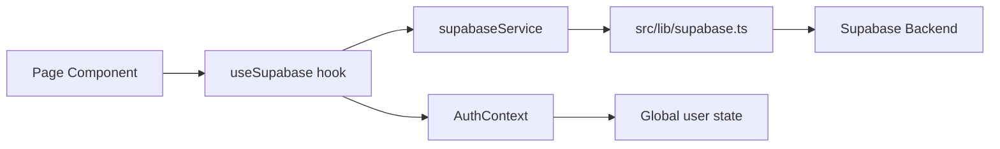
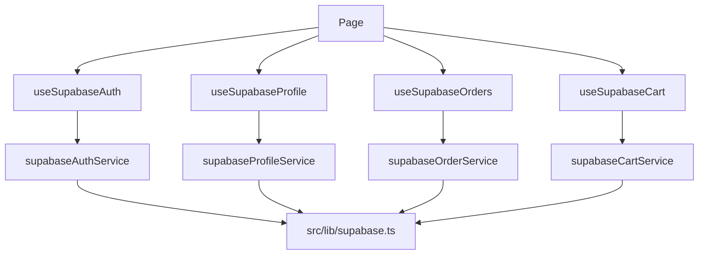

# Supabase Overview

## Purpose
This document explains how Supabase is integrated into the storefront application. Supabase is used for authentication, user profile management, order storage, and cart persistence.

## Integration Status
⚠️ **Important**: The storefront Supabase integration has identified inconsistencies with the admin dashboard. See `admin/ADMIN_STORE_INTEGRATION.md` for details on required changes.

### Key Issues to Address
- **User ID Field Inconsistency**: Store uses `user_id`, admin uses `customer_id`
- **Missing Admin Functions**: Store lacks bulk queries and order status updates needed for admin dashboard
- **Missing Store Functions**: Store needs `customers` table support and enhanced order management

## Key Supabase Files

- `src/lib/supabase.ts`
  - Initializes the Supabase client.
  - Reads environment variables: `VITE_SUPABASE_URL`, `VITE_SUPABASE_ANON_KEY`, `NEXT_PUBLIC_SUPABASE_URL`, `NEXT_PUBLIC_SUPABASE_ANON_KEY`.
  - Enables session persistence, auto-refresh, and URL session detection.

- `src/services/supabase-service.ts`
  - Provides `supabaseAuthService`, `supabaseProfileService`, `supabaseOrderService`, and cart-related helpers.
  - Handles sign-up, sign-in, sign-out, profile reads, order queries, and storage operations.

- `src/hooks/useSupabase.ts`
  - Offers React hooks for auth state, profiles, orders, and cart.
  - Implements state management, loading flags, errors, and callback logic.

- `src/contexts/AuthContext.tsx`
  - Wraps the application in an auth provider.
  - Exposes `useAuth()` to resolve current user state.

## Supabase Architecture Diagram



## Auth Flow

1. `main.tsx` renders `<AuthProvider>` around `<BrowserRouter>`.
2. `AuthProvider` calls `useSupabaseAuth()`.
3. `useSupabaseAuth()` fetches the current user and subscribes to auth state change events.
4. Pages read the current user from `useAuth()`.
5. `signIn`, `signUp`, and `signOut` call `supabaseAuthService`.

## Supabase Routes and Views

### Authentication pages

- `/login` → `LoginPage.tsx`
- `/create-account` → `CreateAccountPage.tsx`
- `/forgot-password` → `ForgotPasswordPage.tsx`

These pages invoke the Supabase auth hook directly for sign-in and account creation.

### User profile pages

- `/personal-info` → `PersonalInfoPage.tsx`
- `/addresses` → `AddressesPage.tsx`
- `/my-orders` → `MyOrdersPage.tsx`
- `/order-details` → `OrderDetailsPage.tsx`

These pages depend on authenticated user state and often fetch user-specific data from Supabase tables.

### Checkout / order flow

- `/checkout` → `CheckoutPage.tsx`
- `/checkout-not-logged-in` → `CheckoutNotLoggedInPage.tsx`
- `/review-and-pay` → `ReviewAndPayPage.tsx`
- `/order-confirmation` → `OrderConfirmationPage.tsx`
- `/order-checkup` → `OrderCheckupPage.tsx`

The checkout flow uses Supabase for order creation and lookup when a user is logged in.

## Service Responsibilities

### `supabaseAuthService`
- `signUp(email, password)`
- `signIn(email, password)`
- `signOut()`
- `getCurrentUser()`
- `resetPassword(email)`
- `updatePassword(newPassword)`
- `uploadAvatar(userId, file)`
- `onAuthStateChange(callback)`

### `supabaseProfileService`
- `getProfile(userId)`
- `createProfile(profile)`
- `upsertProfile(userId, profile)`
- `deleteProfile(userId)`

### `supabaseOrderService`
- `getOrders(userId)`
- `getOrder(orderId)`
- `createOrder(order)`

## Required Integration Changes

### Functions to Add to Store (for Admin Integration)
The following functions need to be added to `src/services/supabase-service.ts` to support admin dashboard requirements:

```typescript
export const supabaseAdminService = {
  // Bulk operations for admin dashboard
  async getAllOrders(limit?: number) {
    // Implementation needed - fetch all orders for admin dashboard
  },
  
  async getAllCustomers(limit?: number) {
    // Implementation needed - fetch all customers for admin dashboard
  },
  
  async updateOrderStatus(orderId: string, status: OrderStatus) {
    // Implementation needed - update order status from admin
  }
}
```

### Schema Alignment Needed
- **Current**: Store uses `user_id` in orders/profiles/carts tables
- **Admin**: Uses `customer_id` linking to customers/profiles tables
- **Required**: Standardize on `user_id` and add `customers` table support to store

### Environment Variables
Store currently supports both patterns:
- `VITE_SUPABASE_URL` / `VITE_SUPABASE_ANON_KEY` (preferred)
- `NEXT_PUBLIC_SUPABASE_URL` / `NEXT_PUBLIC_SUPABASE_ANON_KEY` (fallback)

## Data Flow



## Verified Supabase Structure

- Auth is centralized in `src/contexts/AuthContext.tsx` and `src/hooks/useSupabase.ts`.
- `src/lib/supabase.ts` is the single source of truth for the Supabase client.
- All Supabase operations are abstracted in `src/services/supabase-service.ts`.
- Pages do not call Supabase directly; they use hooks and service functions.

## Notes on Deployment and Env Variables

Supabase integration requires these env variables:
- `VITE_SUPABASE_URL` or `NEXT_PUBLIC_SUPABASE_URL`
- `VITE_SUPABASE_ANON_KEY` or `NEXT_PUBLIC_SUPABASE_ANON_KEY`

`src/lib/supabase.ts` will throw if these are missing.

## Relationship Summary

- `Navbar.tsx` and `Sidebar.tsx` read the user state and render login/logout flows.
- `LoginPage.tsx`, `CreateAccountPage.tsx`, and `ForgotPasswordPage.tsx` are the main auth entry points.
- Profile, address, orders, checkout, and order detail pages all rely on Supabase-authenticated user state.
- Supabase is the backend for user identity and transaction persistence, while Sanity is the backend for product/content data.